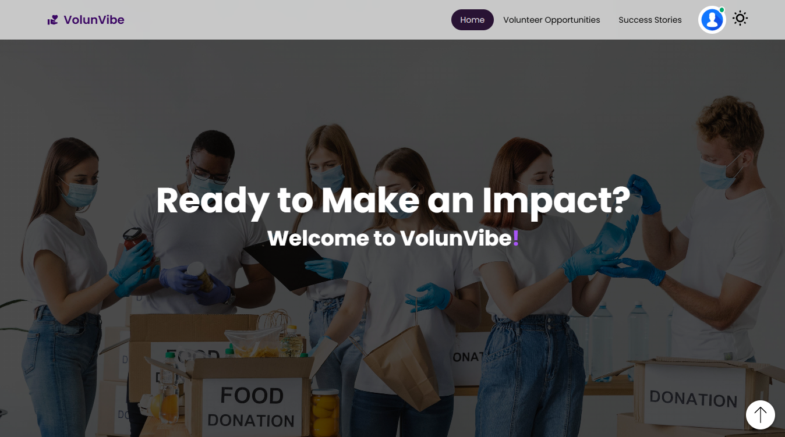

# VolunVibe

VolunVibe is a platform that connects individuals with volunteer opportunities. Users can search for volunteer posts, sign up to volunteer, and also add and manage their own posts to offer volunteer opportunities. Whether you're looking to contribute to a cause or create a new volunteer initiative, VolunVibe makes it easy to find, manage, and share volunteer opportunities within the community.

---

## Screenshot



---


## Live Demo
Visit the live site: [VolunVibe](https://volunvibe.web.app/)

## Features
- **Volunteer Needs Now:** Displays a maximum of six posts with upcoming deadlines for volunteer opportunities.
- **Search Functionality:** Quickly search for volunteer posts by title.
- **Toggle View Options:** Switch between grid and table formats for viewing posts.
- **User Dashboard**: After logging in, users have access to a personalized dashboard where they can view and manage their posts and requests.
- **Date Selection:** Volunteer opportunity deadlines are easy to manage with a date picker.
- **Interactive Animations:** Smooth and engaging transitions using `react-awesome-reveal` and Lottie animations.
- **Responsive Design:** A seamless experience across devices with modern styling.
- **Dynamic Data Management:** Axios ensures fast and reliable API calls, while `firebase` provides robust backend support.
- **Toast Notifications:** Instant feedback using `react-toastify`.


---

## Tech Stack
### Frontend
- **React**: Core framework for building the UI.
- **React Router Dom**: Routing for seamless navigation.
- **Swiper**: For interactive and responsive sliders.

### Styling and Animations
- **Tailwind CSS**: Modern utility-first CSS framework.
- **Lottie React**: For smooth and attractive animations.
- **React Fast Marquee**: Adds dynamic scrolling content.
- **Animate.css**: Pre-built animation library.

### Additional Libraries
- **Firebase**: Authentication and data storage.
- **Axios**: For API integration.
- **Date-fns**: Utility library for working with dates.
- **Sweetalert2**: Attractive alert modals.

---

## npm Packages Used
- **axios**: For making HTTP requests to APIs.
- **date-fns**: Utilities for manipulating and formatting dates.
- **lottie-react**: Integrate Lottie animations into React projects.
- **match-sorter**: Simple and fast sorting of items based on relevance.
- **react-awesome-reveal**: Add animations to React components easily.
- **react-countup**: Animate numerical data, such as statistics.
- **react-datepicker**: User-friendly date picker component.
- **react-fast-marquee**: Smooth scrolling content for banners or tickers.
- **react-helmet-async**: Asynchronous support for `react-helmet`.
- **react-icons**: Collection of popular icons for React projects.
- **react-intersection-observer**: Monitor element visibility within the viewport.
- **react-loader-spinner**: Display loading spinners for asynchronous operations.
- **react-scroll-to-top**: Add a "scroll to top" button in your project.
- **react-toastify**: Display toast notifications for feedback.
- **react-tooltip**: Simple and customizable tooltips for React.
- **sort-by**: Utility for sorting collections by specific keys.
- **sweetalert2**: Beautiful and customizable popup alerts.
- **swiper**: Modern slider component for React.

---

## Setup Instructions

1. **Clone the repository:**
   ```bash
   git clone https://github.com/Atef-Abrar-Bhuyian/VolunVibe-Client.git

2. **Navigate into the project folder:**
    cd VolunVibe-Client

3. **Install dependencies:**
    npm install

4. **Start the development server:**
    npm run dev

---

## Default Credentials

    Email: user@gmail.com
    Password: User123#

